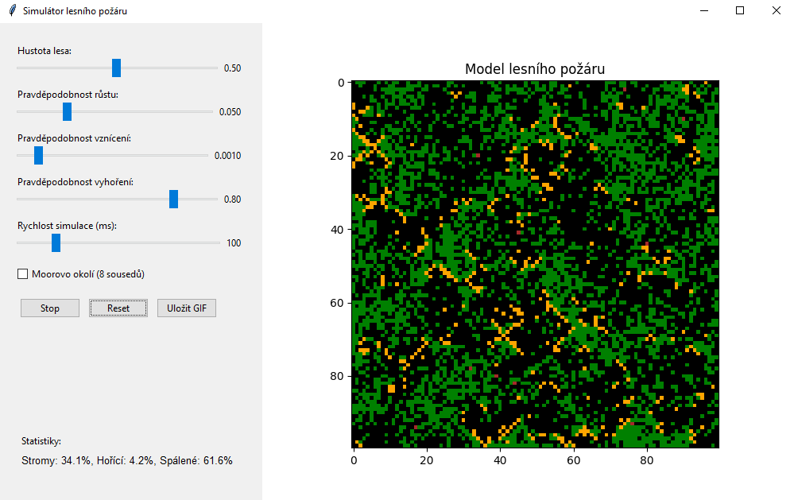
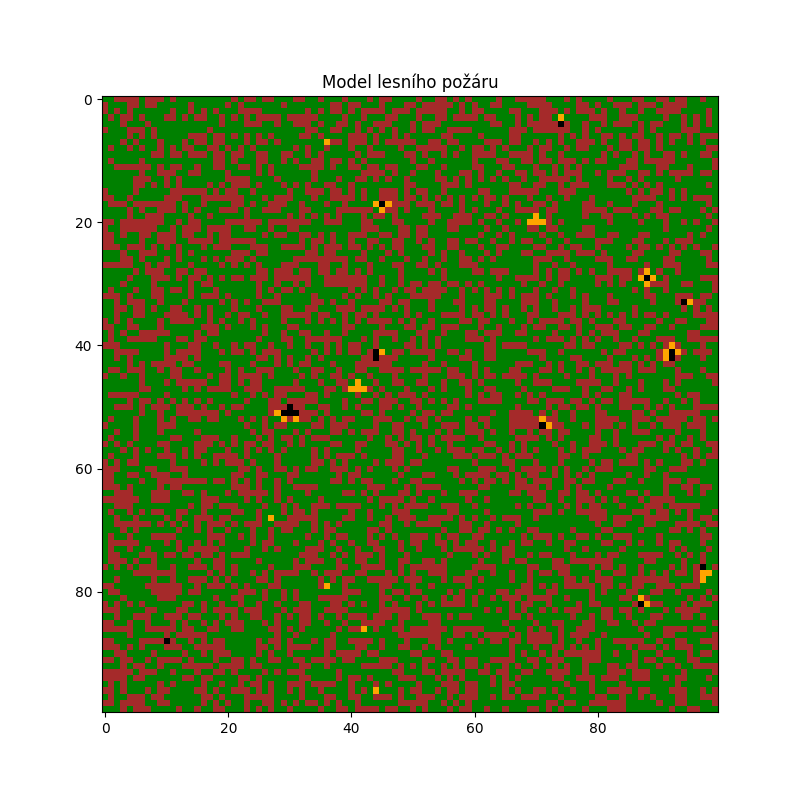

# Simulátor lesního požáru s pomocí Cellular automata

Implementace Cellular automata simulující šíření lesního požáru. Simulace je založena na modelu lesního požáru, který pracuje s buňkami reprezentujícími prázdné plochy, stromy, hořící stromy a spáleniště.

## Popis projektu

Simulátor lesního požáru je napsán v Pythonu s využitím knihoven NumPy pro matematické operace, Matplotlib pro vizualizaci a Tkinter pro grafické uživatelské rozhraní. Program umožňuje sledovat, jak se šíří požár v lese na základě několika parametrů, které lze přizpůsobit.

## Princip fungování

Simulace pracuje na principu celulárního automatu, kde každá buňka v mřížce může být v jednom ze čtyř stavů:
- **EMPTY (0):** Prázdné místo
- **TREE (1):** Strom
- **BURNING (2):** Hořící strom
- **BURNT (3):** Spálený strom (spáleniště)

V každém kroku simulace se stav každé buňky aktualizuje podle následujících pravidel:
1. Prázdné místo nebo spáleniště má šanci `p` (růstová pravděpodobnost), že na něm vyroste nový strom
2. Na stromě může vzniknout požár dvěma způsoby:
   - Od sousedního hořícího stromu
   - Spontánním vznícením s pravděpodobností `f` (pravděpodobnost vznícení)
3. Hořící strom má pravděpodobnost `burnout_prob`, že vyhoří a změní se na spáleniště

## Hlavní komponenty

### Třída `ForestFire`

#### Inicializace lesa
```python
def initialize_forest(self, add_initial_fires=False):
    """Inicializuje les s danou hustotou stromů"""
    self.grid = np.zeros((self.height, self.width), dtype=int)
    # Efektivnější způsob inicializace s využitím náhodnosti Numpy
    random_values = np.random.random((self.height, self.width))
    self.grid = np.where(random_values < self.density, self.TREE, self.EMPTY)

    if add_initial_fires:
        # Přidání počátečních požárů
        for _ in range(3):
            i, j = np.random.randint(0, self.height), np.random.randint(0, self.width)
            if self.grid[i, j] == self.TREE:
                self.grid[i, j] = self.BURNING
```

#### Aktualizace stavu lesa
```python
def update(self):
    """Aktualizuje stav lesa podle pravidel"""
    new_grid = np.copy(self.grid)

    for i in range(self.height):
        for j in range(self.width):
            cell_state = self.grid[i, j]
            
            if cell_state == self.EMPTY or cell_state == self.BURNT:
                # Pravděpodobnost, že na prázdném místě nebo spáleném místě vyroste nový strom
                if np.random.random() < self.p:
                    new_grid[i, j] = self.TREE

            elif cell_state == self.TREE:
                # Buď se strom vznítí od souseda, nebo spontánně
                if self.has_burning_neighbor(i, j) or np.random.random() < self.f:
                    new_grid[i, j] = self.BURNING

            elif cell_state == self.BURNING:
                # Hořící strom má určitou pravděpodobnost vyhoření
                if np.random.random() < self.burnout_prob:
                    new_grid[i, j] = self.BURNT

    self.grid = new_grid
    return self.grid
```

#### Detekce hořících sousedů
```python
def has_burning_neighbor(self, i, j):
    """Kontroluje, zda má buňka hořícího souseda"""
    if self.use_moore:
        # Moorovo okolí (8 směrů)
        for di in [-1, 0, 1]:
            for dj in [-1, 0, 1]:
                if di == 0 and dj == 0:
                    continue
                ni, nj = i + di, j + dj
                if 0 <= ni < self.height and 0 <= nj < self.width and self.grid[ni, nj] == self.BURNING:
                    return True
    else:
        # Von Neumannovo okolí (4 směry)
        neighbors = [(i-1, j), (i+1, j), (i, j-1), (i, j+1)]
        for ni, nj in neighbors:
            if 0 <= ni < self.height and 0 <= nj < self.width and self.grid[ni, nj] == self.BURNING:
                return True
    return False
```

#### Vytvoření animace
```python
def save_animation(self, gif_filename='forest_fire.gif', frames=200):
    """Uloží animaci simulace jako GIF soubor"""
    colors = ['brown', 'green', 'orange', 'black']
    cmap = mcolors.ListedColormap(colors)
    
    fig, ax = plt.figure(figsize=(8, 8)), plt.axes()
    ax.set_title('Model lesního požáru')
    img = ax.imshow(self.grid, cmap=cmap, vmin=0, vmax=3)

    def animate(frame):
        self.update()
        img.set_array(self.grid)
        return [img]
    
    anim = FuncAnimation(fig, animate, frames=frames, interval=100, blit=True)
    anim.save(gif_filename, writer='pillow')
    print(f"Animace uložena jako {gif_filename}")
    plt.close(fig)
```

### Třída `ForestFireSimulatorGUI`

Tato třída poskytuje grafické uživatelské rozhraní pro simulaci. Umožňuje uživateli:
- Nastavovat parametry simulace pomocí posuvníků
- Spouštět a zastavovat simulaci
- Resetovat simulaci
- Ukládat animace jako GIF soubory
- Sledovat statistiky simulace v reálném čase

## Parametry simulace

Simulaci lze upravit pomocí těchto parametrů:

| Parametr | Popis |
|----------|-------|
| `density` | Počáteční hustota stromů v lese (0.0 - 1.0) |
| `p` | Pravděpodobnost růstu nového stromu (0.0 - 0.2) |
| `f` | Pravděpodobnost spontánního vznícení stromu (0.0 - 0.01) |
| `burnout_prob` | Pravděpodobnost vyhoření hořícího stromu (0.0 - 1.0) |
| `use_moore` | Typ okolí pro šíření požáru (True = Moorovo s 8 sousedy, False = Von Neumannovo se 4 sousedy) |

## Ukázky GUI a výstupu

### Grafické uživatelské rozhraní


### Animace simulace lesního požáru



## **Použití**
```python
python main.py # pro spuštění chodu programu
```

## **requirements.txt**
- Všechny potřebné knihovny pro spuštění lze nalézt zde.
